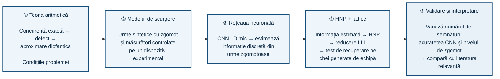

<div align="center">

# Proiect de Cercetare și Inovație pentru RoSEF 2026–2027

### Creat de [Henea Rareș](https://github.com/Vendetaaaa) și [Standler Rareș](https://github.com/RaresInsine)

</div>

</br>

### Domeniile abordate: Matematică și Informatică

## Structura proiectului:

```
📁 RoSEF26-27/
├── 📁 .github/
├── 📁 docs/
├── 📁 informatica/
├── 📁 matematica/
├── 📁 misc/
├── 📁 notebooks/
├── 📁 results/
├── 📁 tests/
├── 📄 .gitignore
├── 📄 CITATION.cff
├── 📄 LICENSE (MIT)
├── 📄 README.md - YOU ARE HERE 🙌
├── 📄 Q&A.txt
└── 📄 requirements.txt
```

---

# Ideea centrală

Proiectul de cercetare "arithmetic_concurrence" din matematica/paper/arithmetic_concurrence.pdf demonstrează două teoreme exacte despre concurența a k
familii de drepte generate de parametri mărginiți: concurența apare doar când există o relație rațională forțată între pante (1), iar pentru k familii generice, condiția devine tot mai rigidă și mai improbabilă pe măsură ce k crește (2).

Această problemă se aseamănă foarte mult cu cea din atacurile asupra semnăturii criptografice [ECDSA](https://en.wikipedia.org/wiki/Elliptic_Curve_Digital_Signature_Algorithm): HNP ( [Hidden Number Problem](https://github.com/kelbyludwig/notebooks/blob/master/The%20Hidden%20Number%20Problem.ipynb) ) folosit pentru a ataca și recupera sute de chei private reale Bitcoin, Ethereum și SSH prin scurgerile minore de informație de nonce (Breitner și Heninger, 2019, „Biased Nonce Sense”).

Așadar noi urmărim:



# Transpunerea din software în hardware

O etapă fundamentală în crearea acestui proiect este de a trece experimentul pe calculator, complet simulat în Python. Din microcontroler de tip esp32, după măsurarea fizică, către trace real, urmat de CNN

În software noi vom:
    1. genera cheia și nonce-ul
    2. executare ECDSA
    3. calcularea modelului HW/HD
    4. adăugarea zgomotului artificial
Iar în hardware:
    1. cheia & nonce-ul este procesat de microcontroler
    2. implementare ECDSA
    3. măsurarea consumului electric sau semnal EM ( sau ambele )
    4. obținere de trace real
    5. trace-ul devine input pentru CNN

Scopul acestei etape este de a verifica dacă teoria poate fi realitate.

<div align="center">

### Code. Collaborate. Enjoy!

### #HappyCoding

</div>

---

**Vrei să ne susții? Ai mai multe opțiuni!**
1. "Star" sau "Watch" acest proiect!
2. Partajează acest proiect prin link-ul: https://github.com/Vendetaaaa/RoSEF26-27
3. Partajează codul QR:

<div align="center">


</div>
